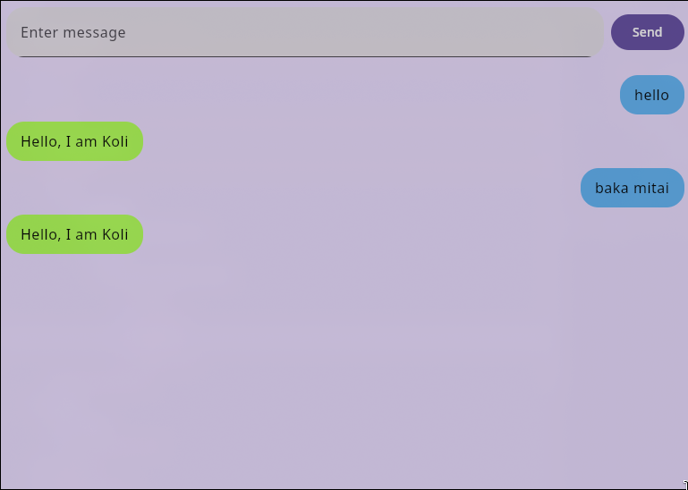

UI for LLM inference written in Kotlin

Made to test the limits of Koltin and for my own enjoyment :)

Version: 0.0.1

###Task List
1. [] Integrate Chat Template from llama.cpp.
2. [] Add an option to load different models.
3. [] Add chat history.
4. [] Figure out how to distribute a linux binary.
5. [] Figure out how to distribute a windows binary.
