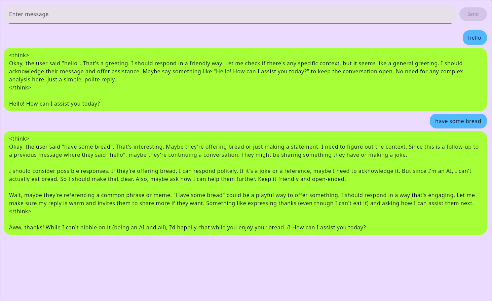

UI for LLM inference written in Kotlin

Made to test the limits of Koltin and for my own enjoyment :)

Version: 0.0.1

###  Task List

1. [x] Integrate Chat Template from llama.cpp.
2. [x] Integrate Streaming. 
3. [ ] Add an option to load different models.
4. [ ] Add chat history.
5. [ ] Figure out how to distribute a linux binary.
6. [ ] Figure out how to distribute a windows binary.
7. [ ] Add thinking on/off for thinking models. 
